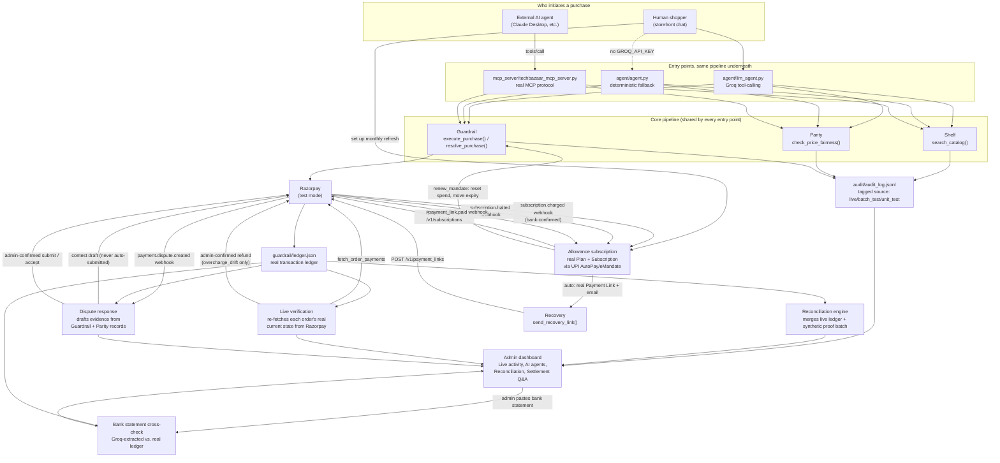

# Architecture

This document explains how TechBazaar actually works end to end, why it's built the way it is, and how it maps to the two hackathon tracks it targets. For setup/run instructions see [README.md](README.md); for the original spec see [BUILD_SPEC.md](BUILD_SPEC.md).

## System overview

The single most important property of this design: **every entry point — the storefront's own chat, and an external AI buyer over MCP — calls the exact same `search_catalog` / `check_price_fairness` / `execute_purchase` functions.** There is no separate, weaker code path for external agents. An AI buyer gets no shortcut around mandate enforcement, fairness checks, or verification.

## The core pipeline

### Shelf (`shelf/shelf.py`)

`search_catalog(query, max_budget_inr) -> {matches, no_match_reason}`. Pure function over `data/catalog.json`, no side effects beyond an audit log entry.

- Synonym normalization (`earphones`→`earbuds`, `noise cancelling`→`anc`, etc.) so typed language matches catalog vocabulary.
- Extracts a rating floor ("at least 4.4"), a quantity ("2 chargers" — surfaced honestly, since only single-unit purchases complete), and a budget, all from free text.
- Returns **more than one match** when genuinely ambiguous rather than guessing — callers (the LLM agent, a human) are expected to ask a follow-up, not silently pick one.
- No match still returns a specific, honest `no_match_reason`, never a bare failure.

### Parity (`parity/parity.py`)

`check_price_fairness(product_id, customer_id, offered_price_inr) -> {verdict, reason, comparison_baseline, explained_by}`.

- Baseline is the **recency-windowed** median of that product's real pricing history (`data/pricing_log.json`), not all-time — a price from a year ago shouldn't anchor "normal" today.
- No history at all → falls back to the catalog's own listed price as the baseline, rather than skipping the check (which would let a brand-new product be offered at any price with zero scrutiny).
- A discount below baseline is only "fair" if the customer has a **legitimate factor** (gold/silver loyalty tier, first-time promo) *and* the discount is within that factor's cap (50% / 30% / 20% respectively) — a factor existing doesn't excuse an unbounded discount.
- A price *above* baseline is never excused by any factor (loyalty/first-time discounts only justify going lower, not higher).

### Guardrail (`guardrail/guardrail.py`)

The only component that touches money. Two purchase paths, same mandate enforcement either way:

- **Mock flow** (`execute_purchase`) — used by automated tests/batches. Deterministic fake Razorpay responses (`guardrail/razorpay_client.py`), resolves immediately to success/blocked/failed_verification.
- **Real flow** (`initiate_purchase` → human completes Checkout → `confirm_purchase`) — used whenever real Razorpay test-mode credentials are configured. Creates a genuine test-mode order, hands off to Razorpay's real Checkout UI, and only marks success after independently asking Razorpay what was actually captured — **never trusts the frontend's say-so**.
- `resolve_purchase()` is the single entry point both agent implementations and the MCP server call; it picks mock or real automatically based on whether real credentials exist.

**Two real concurrency races were found and fixed here** (not hypothetical — reproduced with `threading.Barrier` to force genuinely simultaneous execution):

1. **Mandate-spend race**: two purchases against the same mandate, reserving spend as two separately-locked steps, could both read the same starting spend and both "pass," letting the mandate limit be exceeded. Fixed by making the whole read-check-write into one atomic, lock-held operation (`_atomic_reserve_spend`).
2. **Confirm-purchase idempotency race**: an earlier fix protected against a *sequential* double-confirm of the same order, but two genuinely *concurrent* confirms of the same `razorpay_order_id` could both pass the idempotency check before either had committed, then both apply spend for one real payment. Fixed by folding the idempotency check, spend reservation, and ledger write into a single atomic critical section (`_atomic_confirm_and_reserve`).

Mandate ownership is enforced too: `get_mandate_token(mandate_id, requesting_customer_id)` returns "unknown" (a `KeyError`, not a distinguishable 403) for both a truly-nonexistent mandate *and* one that exists but belongs to someone else — so a guessed ID belonging to another customer can never be confirmed to exist. This closed a real IDOR found during development.

## Two agent implementations, one pipeline

`agent/llm_agent.py` is what actually runs (Groq, OpenAI-compatible tool-calling). It:

- Distinguishes **browsing** ("wireless earbuds under 1000") from **explicit buy intent** ("buy the earbuds") — browsing stops after showing the match and asking; only explicit buy language runs the full search→fairness→purchase pipeline. This was a real, found-via-testing bug: earlier prompt versions attempted (and reported blocked) purchases nobody asked for.
- Retries through Groq's tokens-per-minute rate limit (`agent/groq_client.py`, shared with `reconciliation/settlement_qa.py`) — the system prompt + tool schema gets resent on every call in a multi-step tool-calling turn, which can burn through the per-minute budget fast. Found via testing: 5 of 6 rapid messages failed with a raw `429` before this existed.
- Offers a real upsell suggestion (`growth/upsell.py`) after a successful purchase, never before, never for a multi-item turn still in progress.

`agent/agent.py` is the deterministic regex-routed fallback (used only when `GROQ_API_KEY` isn't set), calling the identical three pipeline functions.

## MCP server — the external AI buyer surface

`mcp_server/techbazaar_mcp_server.py` is a real [MCP](https://modelcontextprotocol.io) server (`FastMCP`, stdio transport) exposing nine tools: `register_ai_buyer`, `create_mandate`, `search_catalog`, `check_price_fairness`, `negotiate_price`, `purchase`, `confirm_purchase`, `get_upsell_suggestions`, `get_store_overview`.

- An AI buyer gets its own identity namespace (`ai_buyer_NNN`, never overlapping with human `cNNN` customer IDs) — so the audit trail can always tell an autonomous purchase from a human one at a glance.
- `create_mandate` sets a bounded, expiring spend limit *before* shopping — `purchase()` enforces it through the exact same race-free Guardrail path human purchases use.
- Verified as a genuine, spec-compliant server (not just "the functions work if you import them directly") by `mcp_server/verify_real_mcp_connection.py`: spawns the server as a real subprocess and drives it with an actual `mcp.ClientSession` over `tools/list`/`tools/call` JSON-RPC.

## Negotiation — real agent-to-agent price haggling

`negotiation/negotiation.py`'s `propose_price(product_id, offered_price_inr, customer_id, round_number)` is deliberately open territory: checked against Razorpay's own Agentic Payments, Agent Studio, and Agentic Platform docs before building it, and none of them cover an agent *negotiating* a price — only an agent triggering an already-approved payment. This is genuine agent-to-agent commerce: two real decision-makers (an AI buyer, and the merchant's own pricing agent standing in here) reach a real, executable agreement.

The counter-offer is never invented — it's exactly the lowest price `parity.get_baseline_and_factor()` (the same baseline/discount-factor computation `check_price_fairness` itself uses, extracted into one shared function so the two can never silently drift apart) would still call fair for that product and that customer's real discount eligibility. The merchant agent never concedes past its own fairness rules to close a deal, and never haggles forever (`MAX_ROUNDS = 3`, the same "gated" principle as everything else here). A real off-by-rounding bug was found and fixed during testing: rounding the floor price down (`round()`) quoted a counter slightly below the true fairness floor, so a buyer accepting the exact quoted number got countered again for the same price, forever — fixed with `math.ceil()` so the quoted counter is always genuinely acceptable.

Exposed identically to both the MCP server (`negotiate_price`, for an external AI buyer) and the storefront's own LLM agent (`agent/llm_agent.py`, for a human asking to haggle) — same underlying function, same fairness bounds, no separate "human negotiation" ruleset that could drift from the agent one. Verified live over the real MCP protocol (`mcp_server/_demo_negotiate.py`): a real lowball offer, a real principled counter, acceptance, and a real Razorpay checkout at the negotiated price rather than the listed one.

## Reconciliation — closing the finance-ops loop

`reconciliation/reconciliation.py`'s `reconcile(orders, settlements)` matches every order against its settlement(s) and classifies each one as matched or a specific exception type (`amount_mismatch`, `missing_settlement`, `duplicate_settlement`, `status_exception`) — plus `orphan_settlement` for a settlement with no matching order at all. **Every record is accounted for; none are silently dropped.**

Two sources are merged, always tagged:

- `synthetic_seed` — a fixed 53-order batch (`data/generate_reconciliation_seed.py`, seeded RNG) with a known-in-advance `_expected_reconciliation_status` per order, so classification accuracy is *measured* against ground truth, not asserted.
- `live_ledger` — every real transaction in `guardrail/ledger.json` (including AI-buyer purchases over MCP), converted to the same order/settlement shape via `load_live_orders_and_settlements()`.

Classification accuracy is reported **only against the synthetic subset** (the only one with a scripted correct answer) — folding live data into that number would overstate what's actually been verified. `reconciliation/settlement_qa.py` is a second Groq tool-calling agent, scoped to three read-only tools (`get_batch_summary`, `get_order_detail`, `list_exceptions`) over this same real data — it cannot search the catalog, check fairness, or move money.

## Live verification — reconciling against Razorpay's own current record, not our snapshot of it

`reconciliation/reconciliation.py`'s batch above answers "does our internal ledger agree with our own settlement records" — a genuinely useful check, but a closed loop: both sides are files this app already wrote. `reconciliation/live_verification.py` closes a different gap, one the ledger-vs-ledger check structurally cannot see: for every real captured purchase, it calls `guardrail/razorpay_rest.py` (the same real REST client the live checkout flow itself uses, not the Docker-based MCP client, which is deliberately kept out of the live request path) to ask Razorpay, right now, what that order's payment actually looks like today — not what our ledger recorded the moment `confirm_purchase()` ran.

That distinction matters because a payment's state can change *after* we last looked — most concretely, a refund issued by hand straight in the Razorpay Dashboard, entirely bypassing this app, which the ledger would have no way to know about. `check_live_drift()` re-fetches and classifies every live order into:

- **clean** — Razorpay's current record agrees with what we expected.
- **`overcharge_drift`** — Razorpay shows *more* captured than this order was ever meant to charge. Unambiguous: the only correct fix is a refund of the difference.
- **`undercharge_drift`** — Razorpay shows *less* captured than expected. Flagged for manual review only — could be a legitimate refund, a dispute, a chargeback; this system has no way to know why, so it never guesses.
- **`refund_not_reflected`** — the ledger already believes an order was refunded, but Razorpay's current record disagrees.

Only `overcharge_drift` is remediable, and even then never blindly: `remediate_overcharge()` re-verifies fresh against Razorpay *immediately before* issuing the refund rather than trusting a result computed even a few seconds earlier — so a refund already issued by someone else in the meantime (or a second admin double-clicking the same button) can't double-refund the same order. It's exposed on the dashboard as a "Refund overcharge" button behind a native confirm dialog, and to Settlement Q&A as a read-only tool (`get_live_drift_check`) — the LLM agent can report a remediable exception but is never wired to trigger the refund itself; that stays a deliberate, confirmed human click. Proven by 16 tests in `reconciliation/test_live_verification.py` covering every drift type, partial vs. full refunds (Razorpay only flips a payment's own `status` to `"refunded"` on a *full* refund — a partial refund leaves `status: "captured"` with a nonzero `amount_refunded`, which an earlier, naive `status == "captured"` filter would have silently missed), and the remediation guardrails (re-verify-before-acting, refuse on an already-fixed order, refuse on an unknown order).

## Bank-registered allowance top-ups — closing the "who enforces the mandate" gap

Every mandate in this system, until now, was enforced by exactly one thing: Guardrail's own database check (`_validate_mandate_data`). That's real and race-free (see the concurrency section above), but it's still just this app's own server code -- a bug or a compromise there is the only thing standing between an AI agent and its spend cap. Razorpay has a real product for exactly this gap: UPI AutoPay / eMandate, a recurring authorization the customer's own bank or UPI app independently confirms, not something the merchant's server can quietly exceed.

`subscriptions/allowance_subscription.py` uses this deliberately narrowly. Razorpay's Subscriptions API (`POST /v1/plans`, `POST /v1/subscriptions`) is genuinely self-serve test-mode REST -- confirmed the same way Disputes was, via "fork the Postman workspace with your test keys," unlike Route, Payouts, Magic Checkout, or Recurring Payments (all gated behind an on-demand approval request). But a Subscription is a fixed-amount, fixed-schedule recurring bill, not a flexible pool a merchant draws down on demand at arbitrary times -- that primitive is what Razorpay actually calls Recurring Payments, and that one *is* gated. Claiming this feature makes Guardrail's ad-hoc, merchant-triggered spend drawdown itself bank-enforced would be dishonest about what a Subscription is. What it's honestly scoped to instead: a customer can register a real monthly top-up ("refresh my AI agent's ₹5000 allowance every month") via UPI AutoPay/eMandate/card at Razorpay's own real hosted checkout (the `short_url` a real `POST /v1/subscriptions` call returns) -- and the refresh itself only ever happens because Razorpay's own banking rail already confirmed that period's charge.

The mechanism: `guardrail.renew_mandate(mandate_id, new_expires_at)` resets the mandate's spend counter to 0 and moves its expiry to `new_expires_at` -- `max_amount_inr`, the ceiling itself, is never touched, so a refresh makes the existing ceiling available again rather than growing it. It's only ever called from `_handle_subscription_charged` in `api/routes/webhooks.py`, reacting to a real, signature-verified `subscription.charged` webhook -- the same HMAC verification `payment.captured` and the dispute webhooks already use. `new_expires_at` is the webhook payload's own real `current_end`, Razorpay's actual billing-cycle boundary, not a guessed 30-day offset, so the mandate's window matches the bank-confirmed cycle exactly. Idempotent against webhook redelivery via `paid_count`: Razorpay increments it by exactly 1 per real cycle, so a redelivered event for an already-processed cycle is a safe no-op, not a double top-up (proven directly in `api/test_webhooks.py`'s redelivery test).

Verified live, not just unit-tested: `subscriptions/_demo_allowance_subscription.py` creates a real mandate, a real Plan and Subscription against Razorpay's actual test-mode API (visible in the real Dashboard), then POSTs a real signed `subscription.charged` webhook to a running server -- and the mandate's spend counter genuinely resets to 0 as an observed, not simulated, result. Also exercised end-to-end through the real customer-authenticated storefront UI (a logged-in customer's "Set up automatic monthly refresh" flow, verified live).

### Recovery — an autonomous nudge when the bank rail itself gives up

Razorpay's own Agent Studio names a "Subscription Recovery" agent that "analyzes failed subscription payments, applies smarter retry logic, and triggers targeted customer nudges." Razorpay already does the retrying on our behalf (that's what the `pending` -> `halted` lifecycle *is*); what was missing was the nudge. When `_handle_subscription_status_event` sees a real `subscription.halted` webhook -- Razorpay has genuinely exhausted its own retries -- `update_subscription_status()` calls `send_recovery_link()` automatically, no admin click required. That's a deliberate exception to this project's own "never auto-act on anything irreversible" rule: sending an email is neither destructive nor irreversible (unlike a refund or a submitted dispute), the same reasoning that already lets a support request's confirmation email send itself elsewhere in this codebase.

`send_recovery_link()` calls the real, self-serve `POST /v1/payment_links` API for exactly the halted subscription's monthly amount, and emails the real `short_url` via Resend. A real `payment_link.paid` webhook (`_handle_payment_link_paid`, matched via the link's own `notes.purpose == "allowance_recovery"` so an unrelated Payment Link on the same account is never mistaken for one of ours) then renews the mandate through `handle_recovery_payment()` -- the same shape as `handle_subscription_charged`, just anchored to a flat 30-day window instead of a real `current_end`, since a one-time Payment Link has no billing cycle to read one from. Idempotent against webhook redelivery via `payment_link_id`, proven directly in `api/test_webhooks.py`. The dashboard's "Allowance subscriptions" panel shows every subscription's real status and recovery history, with a manual "Resend" action for when a customer says the email never arrived.

## Bank statement cross-check — a third reconciliation source

Every reconciliation check so far compares two sources this app already controls: its own ledger, and Razorpay's own API. Razorpay's own Agentic Platform names the actually-realistic finance-ops gap this leaves: "Intelligent Reconciliation" -- upload a screenshot of your bank statement, an agent extracts UTR numbers and amounts and cross-references them against Razorpay records. The bank statement is the ground truth a founder actually reconciles against; neither the ledger-vs-ledger check nor live-verification can see it.

`reconciliation/bank_statement.py` builds this scoped to what's realistic without OCR: an admin pastes bank statement text (CSV rows or copy-pasted lines) into the dashboard, and `parse_bank_statement()` extracts structured transactions via a **forced** Groq tool call (`tool_choice` pinned to `record_transactions`, not `"auto"`) -- the same reliability reasoning behind every other structured extraction in this codebase: a tool call's arguments are valid JSON by construction, so there's no brittle "hope the model's free text parses" step.

Matching is honestly scoped too: test mode generates no real bank settlement cycle at all (see `guardrail/razorpay_mcp_client.py`'s docstring), so there is no real UTR on our side to match against, ever. `match_statement_to_ledger()` matches by amount (within a small tolerance) and date proximity instead -- a real fallback finance teams already reach for when UTR data isn't reliably available on both sides, not a workaround invented for this demo. Greedy, first-fit matching means a duplicate line in the statement correctly shows up as unmatched rather than silently double-counting the same real order. A live-mode account gets exact UTR matching for free, since Razorpay's own real settlement records carry one.

## Disputes — AI-drafted chargeback evidence from the real audit trail

Reconciliation and live verification both defend against *this system's own* records being wrong. `disputes/dispute_response.py` defends against a different, harder case: a customer's bank disputing a payment that was, in fact, legitimate. Razorpay's real Disputes API (`GET /v1/disputes`, `PATCH /v1/disputes/:id/contest`, `POST /v1/disputes/:id/accept`) is plain self-serve test-mode REST — unlike Route, Payouts, Recurring Payments, or Magic Checkout, none of which are usable without Razorpay approving an on-demand activation request first.

When a real, signature-verified `payment.dispute.created` webhook arrives (`api/routes/webhooks.py`, extending the exact same HMAC verification the `payment.captured` handler already does), `draft_evidence_from_audit_trail()` looks up the disputed order's real Guardrail verification record and the Parity fairness check that gated it, and composes a natural-language defense: the mandate that authorized it, the fairness verdict at time of purchase, and Guardrail's own independent re-verification of the captured amount with Razorpay. That draft is saved via a real `PATCH .../contest` call with `action: "draft"` — a real, Razorpay-documented distinction from `action: "submit"`: a draft is saved on Razorpay's own system but never sent to the customer's bank. Nothing in this codebase ever passes `action: "submit"` or calls `POST .../accept` except two explicit, admin-initiated dashboard actions — the same "detect, don't auto-act on anything irreversible" shape as live-verification's remediation button.

Razorpay exposes no self-serve way to create a real test-mode dispute (they're bank/issuer-initiated), so there's no way to fully exercise the real `contest`/`accept` calls end to end without an actual dispute on the account — a real, honestly-documented limitation (see README.md's "Demoing the disputes feature"), not a gap in the code. `disputes/_demo_dispute.py` sends a genuine, HMAC-signed HTTP webhook to a running server referencing a real completed order, so the signature verification, the evidence drafting, and the (honestly-404ing) real Razorpay call are all exercised for real; only the "a real dispute already exists" precondition can't be manufactured on demand. Proven otherwise by 19 tests across `disputes/test_dispute_response.py` and `api/test_webhooks.py`'s dispute-event cases (evidence drafting with and without a matching order, the real-API-404 path handled honestly, status-sync from `payment.dispute.{won,lost,closed,under_review,action_required}`, and the submit/accept guardrails).

## The audit trail and source tagging

`audit/audit_log.py` is one shared, append-only JSONL log every component writes real acceptance evidence to. Every entry carries `source`:

- `"live"` (default) — genuine API/chat/MCP traffic.
- `"batch_test"` — set by every `batch_tests/*.py` script at import time.
- `"unit_test"` — set once, session-wide, by the root `conftest.py` (picked up automatically by pytest regardless of which subdirectory is targeted).

This exists because, without it, a batch script run and a real customer action were indistinguishable in the log — which is exactly what made early dashboard iterations look synthetic even where the underlying engines were genuinely working. `GET /api/live-stats` computes the dashboard's **Live activity** panel from `source == "live"` entries only; `GET /api/audit-log?source=live` lets the click-to-drill-down UI fetch only real entries — filtered server-side, *before* the response's `limit` is applied (a heavy batch run's volume could otherwise push real entries out of a naively-limited window entirely, which happened for real during testing).

## Security model

- **Domain-separated session signing keys**: admin and customer sessions are HMAC-signed with keys derived as `HMAC(SESSION_SIGNING_SECRET, "admin_session")` vs `"customer_session"` — not the same underlying secret. This closed a real, critical vulnerability found during development: with a shared key, any logged-in customer's session token verified successfully against the *admin* check too, letting any shopper reach the merchant dashboard.
- **Real session revocation** (`api/session_revocation.py`): logout actually invalidates the token server-side (a disk-persisted revocation list), not just a cosmetic cookie delete.
- **Rate limiting** (`api/rate_limit.py`): 5 failed login attempts within 5 minutes locks that key out for 5 minutes, persisted to disk and cross-process-locked — a purely in-memory limiter would let an attacker's requests spread across multiple worker processes each get their own independent budget.
- **Cross-process file locking** (`api/file_lock.py`): atomic lockfile creation (`O_CREAT|O_EXCL`, safe on both Windows and POSIX) shared by the mandate store, rate limiter, and session revocation list — a plain `threading.Lock` only protects within one process, not across `--workers N`.
- **Test/demo isolation** (`guardrail.use_isolated_store`): every test file and batch script redirects the mandate store and ledger to isolated files before calling `reset_mandate_store()`, which otherwise rebuilds the *real* store from seed fixtures and discards any real in-progress mandate. This was a real bug, found and fixed after it actually wiped a real AI-buyer mandate mid-development.

## Support requests and email

`audit/support_log.py` + `audit/mailer.py`: a customer can file an issue (general, via a "Contact support" link on the storefront checkout card, or scoped to a specific blocked/flagged result). Filing sends a real confirmation email via [Resend](https://resend.com); admin resolving it on the dashboard sends a real, distinct follow-up email. Both outcomes (`confirmation_email`, `resolution_email`) are recorded on the request itself, independently — a failure on one is never confused with the other, and is reported honestly rather than assumed to have succeeded.

---

## Track alignment

TechBazaar targets a mix of **Track 1 (AI Growth & Agentic Commerce)** and **Track 4 (AI Finance Controller)**.

### Track 1 — "grow the merchant's revenue, and make them sellable to AI buyers"

> The bar: *every money action explainable, bounded and gated. Show the audit trail and one failure handled gracefully.*

| Bar | Where |
|---|---|
| Sellable to AI buyers end to end | `mcp_server/techbazaar_mcp_server.py` — a real MCP server, not a mocked "AI buyer" script calling its own API. Verified via genuine spawned-subprocess protocol test. |
| Bounded | Guardrail mandates — a spend limit an AI buyer's own `purchase()` calls cannot exceed, enforced by the merchant, not trusted from the caller. Proven race-free under real concurrent load. |
| Bounded, defense-in-depth | `subscriptions/allowance_subscription.py` — a customer can optionally register their mandate's monthly refresh as a real UPI AutoPay/eMandate authorization, so the spend ceiling isn't only enforced by this app's own database: the customer's bank independently confirms it too. |
| Gated | Every purchase runs `check_price_fairness` before `execute_purchase`; a flagged price is never bought. |
| Explainable / audit trail | Every action — human or AI-buyer — lands in `audit_log.jsonl`, attributable by `customer_id`/`requesting_customer_id`, visible live on the dashboard's Connected AI Agents and Live Activity panels. |
| One failure handled gracefully | Multiple real paths: over-budget mandate block (with the exact reason and what would fix it), wrong-mandate-ownership block (IDOR-safe, not just a generic 403), flagged-price refusal, Groq rate-limit retry-then-honest-failure. |
| Grow revenue | `growth/upsell.py` — real, catalog-grounded complementary-product suggestions offered after a purchase, by both the storefront agent and the MCP server. |
| Agent-to-agent commerce | `negotiation/negotiation.py` — genuine price negotiation, bounded by Parity's own fairness math the whole way. Not a metaphor: an AI buyer and the merchant's pricing agent are two real, independent decision-makers reaching a real agreement, verified live over the actual MCP protocol. |

### Track 4 — "run the books and the cash position"

> The bar: *throughput plus measured accuracy plus an honest exception list. One cherry-picked match proves nothing.*

| Bar | Where |
|---|---|
| Throughput | 53-order batch (above the 50+ threshold), merged with every real transaction as it happens. |
| Measured accuracy | 100% classification accuracy, computed against seeded ground truth (`_expected_reconciliation_status`) that was fixed before the engine ever ran against it — not asserted after the fact. |
| Honest exception list | Every unmatched record surfaces as one of 5 typed exceptions with a specific reason (exact ₹ diff, exact settlement ID) — nothing is silently dropped, and `orphan_settlement` covers the one case that isn't even keyed to a real order. |
| Not cherry-picked | The batch is deliberately *not* all-clean matches (14 seeded exceptions across all 5 types) — a 100%-clean batch would prove nothing about exception handling. |
| Settlement Q&A agent | `reconciliation/settlement_qa.py` — a second Track 4 example direction, built alongside the batch report rather than instead of it. |
| Detect *and* fix, not just detect | `reconciliation/live_verification.py` — re-verifies real purchases against Razorpay's own current record (not just this app's own files) and, for the one exception type that's unambiguous (`overcharge_drift`), lets an admin issue a real, re-verified-before-acting refund for exactly the difference in one click, closing the loop from "we found a discrepancy" to "it's fixed" rather than stopping at detection. |
| Defend, not just detect | `disputes/dispute_response.py` — a real chargeback webhook gets a real AI-drafted evidence response, built from this system's own verified audit trail and saved as a real draft on Razorpay's side, with submission/acceptance always a deliberate, confirmed admin click. A materially harder finance-ops problem than reconciliation alone, using an unrestricted, self-serve real Razorpay API. |
| A third, independent source of truth | `reconciliation/bank_statement.py` — reconciles against the merchant's actual bank statement, not just this app's own ledger and Razorpay's own API. Directly answers Track 4's own "throughput plus measured accuracy" bar with a source neither of the other two checks can see. |
| Autonomous recovery, not just detection | `subscriptions/allowance_subscription.py`'s `send_recovery_link()` — when Razorpay's own retries are exhausted, a real one-time Payment Link is generated and emailed automatically, closing the loop from "a real charge failed" to "the customer already has a working fix in their inbox," the same shape as Razorpay's own named "Subscription Recovery" agent. |

### What's honestly still open

- Real email delivery (Resend) only reaches the address your Resend account itself is registered with, until a domain is verified — everything else gets a real, honest rejection rather than a silent failure.
- The dashboard's Live Activity panel starts at zero on a fresh clone — that's correct behavior, not a bug; it only moves as real people (or real AI buyers) actually use the app.
- `data/customer_profiles.json` and `api/customers_auth.json` are gitignored (they accumulate real test-customer data over a session) — a fresh clone has no pre-existing customer accounts to start from.
