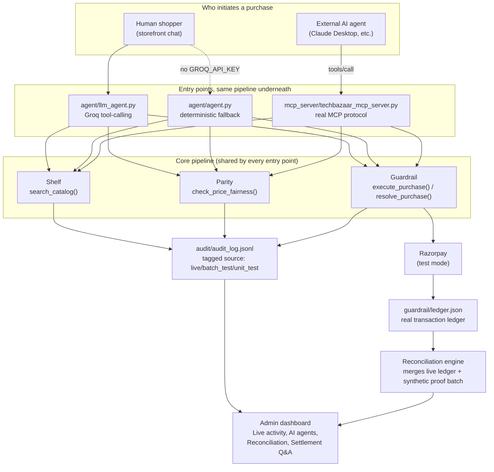

# Architecture

This document explains how TechBazaar actually works end to end, why it's built the way it is, and how it maps to the two hackathon tracks it targets. For setup/run instructions see [README.md](README.md); for the original spec see [BUILD_SPEC.md](BUILD_SPEC.md).

## System overview

The single most important property of this design: **every entry point — the storefront's own chat, and an external AI buyer over MCP — calls the exact same `search_catalog` / `check_price_fairness` / `execute_purchase` functions.** There is no separate, weaker code path for external agents. An AI buyer gets no shortcut around mandate enforcement, fairness checks, or verification.

## The core pipeline

### Shelf (`shelf/shelf.py`)

`search_catalog(query, max_budget_inr) -> {matches, no_match_reason}`. Pure function over `data/catalog.json`, no side effects beyond an audit log entry.

- Synonym normalization (`earphones`→`earbuds`, `noise cancelling`→`anc`, etc.) so typed language matches catalog vocabulary.
- Extracts a rating floor ("at least 4.4"), a quantity ("2 chargers" — surfaced honestly, since only single-unit purchases complete), and a budget, all from free text.
- Returns **more than one match** when genuinely ambiguous rather than guessing — callers (the LLM agent, a human) are expected to ask a follow-up, not silently pick one.
- No match still returns a specific, honest `no_match_reason`, never a bare failure.

### Parity (`parity/parity.py`)

`check_price_fairness(product_id, customer_id, offered_price_inr) -> {verdict, reason, comparison_baseline, explained_by}`.

- Baseline is the **recency-windowed** median of that product's real pricing history (`data/pricing_log.json`), not all-time — a price from a year ago shouldn't anchor "normal" today.
- No history at all → falls back to the catalog's own listed price as the baseline, rather than skipping the check (which would let a brand-new product be offered at any price with zero scrutiny).
- A discount below baseline is only "fair" if the customer has a **legitimate factor** (gold/silver loyalty tier, first-time promo) *and* the discount is within that factor's cap (50% / 30% / 20% respectively) — a factor existing doesn't excuse an unbounded discount.
- A price *above* baseline is never excused by any factor (loyalty/first-time discounts only justify going lower, not higher).

### Guardrail (`guardrail/guardrail.py`)

The only component that touches money. Two purchase paths, same mandate enforcement either way:

- **Mock flow** (`execute_purchase`) — used by automated tests/batches. Deterministic fake Razorpay responses (`guardrail/razorpay_client.py`), resolves immediately to success/blocked/failed_verification.
- **Real flow** (`initiate_purchase` → human completes Checkout → `confirm_purchase`) — used whenever real Razorpay test-mode credentials are configured. Creates a genuine test-mode order, hands off to Razorpay's real Checkout UI, and only marks success after independently asking Razorpay what was actually captured — **never trusts the frontend's say-so**.
- `resolve_purchase()` is the single entry point both agent implementations and the MCP server call; it picks mock or real automatically based on whether real credentials exist.

**Two real concurrency races were found and fixed here** (not hypothetical — reproduced with `threading.Barrier` to force genuinely simultaneous execution):

1. **Mandate-spend race**: two purchases against the same mandate, reserving spend as two separately-locked steps, could both read the same starting spend and both "pass," letting the mandate limit be exceeded. Fixed by making the whole read-check-write into one atomic, lock-held operation (`_atomic_reserve_spend`).
2. **Confirm-purchase idempotency race**: an earlier fix protected against a *sequential* double-confirm of the same order, but two genuinely *concurrent* confirms of the same `razorpay_order_id` could both pass the idempotency check before either had committed, then both apply spend for one real payment. Fixed by folding the idempotency check, spend reservation, and ledger write into a single atomic critical section (`_atomic_confirm_and_reserve`).

Mandate ownership is enforced too: `get_mandate_token(mandate_id, requesting_customer_id)` returns "unknown" (a `KeyError`, not a distinguishable 403) for both a truly-nonexistent mandate *and* one that exists but belongs to someone else — so a guessed ID belonging to another customer can never be confirmed to exist. This closed a real IDOR found during development.

## Two agent implementations, one pipeline

`agent/llm_agent.py` is what actually runs (Groq, OpenAI-compatible tool-calling). It:

- Distinguishes **browsing** ("wireless earbuds under 1000") from **explicit buy intent** ("buy the earbuds") — browsing stops after showing the match and asking; only explicit buy language runs the full search→fairness→purchase pipeline. This was a real, found-via-testing bug: earlier prompt versions attempted (and reported blocked) purchases nobody asked for.
- Retries through Groq's tokens-per-minute rate limit (`agent/groq_client.py`, shared with `reconciliation/settlement_qa.py`) — the system prompt + tool schema gets resent on every call in a multi-step tool-calling turn, which can burn through the per-minute budget fast. Found via testing: 5 of 6 rapid messages failed with a raw `429` before this existed.
- Offers a real upsell suggestion (`growth/upsell.py`) after a successful purchase, never before, never for a multi-item turn still in progress.

`agent/agent.py` is the deterministic regex-routed fallback (used only when `GROQ_API_KEY` isn't set), calling the identical three pipeline functions.

## MCP server — the external AI buyer surface

`mcp_server/techbazaar_mcp_server.py` is a real [MCP](https://modelcontextprotocol.io) server (`FastMCP`, stdio transport) exposing eight tools: `register_ai_buyer`, `create_mandate`, `search_catalog`, `check_price_fairness`, `purchase`, `confirm_purchase`, `get_upsell_suggestions`, `get_store_overview`.

- An AI buyer gets its own identity namespace (`ai_buyer_NNN`, never overlapping with human `cNNN` customer IDs) — so the audit trail can always tell an autonomous purchase from a human one at a glance.
- `create_mandate` sets a bounded, expiring spend limit *before* shopping — `purchase()` enforces it through the exact same race-free Guardrail path human purchases use.
- Verified as a genuine, spec-compliant server (not just "the functions work if you import them directly") by `mcp_server/verify_real_mcp_connection.py`: spawns the server as a real subprocess and drives it with an actual `mcp.ClientSession` over `tools/list`/`tools/call` JSON-RPC.

## Reconciliation — closing the finance-ops loop

`reconciliation/reconciliation.py`'s `reconcile(orders, settlements)` matches every order against its settlement(s) and classifies each one as matched or a specific exception type (`amount_mismatch`, `missing_settlement`, `duplicate_settlement`, `status_exception`) — plus `orphan_settlement` for a settlement with no matching order at all. **Every record is accounted for; none are silently dropped.**

Two sources are merged, always tagged:

- `synthetic_seed` — a fixed 53-order batch (`data/generate_reconciliation_seed.py`, seeded RNG) with a known-in-advance `_expected_reconciliation_status` per order, so classification accuracy is *measured* against ground truth, not asserted.
- `live_ledger` — every real transaction in `guardrail/ledger.json` (including AI-buyer purchases over MCP), converted to the same order/settlement shape via `load_live_orders_and_settlements()`.

Classification accuracy is reported **only against the synthetic subset** (the only one with a scripted correct answer) — folding live data into that number would overstate what's actually been verified. `reconciliation/settlement_qa.py` is a second Groq tool-calling agent, scoped to three read-only tools (`get_batch_summary`, `get_order_detail`, `list_exceptions`) over this same real data — it cannot search the catalog, check fairness, or move money.

## The audit trail and source tagging

`audit/audit_log.py` is one shared, append-only JSONL log every component writes real acceptance evidence to. Every entry carries `source`:

- `"live"` (default) — genuine API/chat/MCP traffic.
- `"batch_test"` — set by every `batch_tests/*.py` script at import time.
- `"unit_test"` — set once, session-wide, by the root `conftest.py` (picked up automatically by pytest regardless of which subdirectory is targeted).

This exists because, without it, a batch script run and a real customer action were indistinguishable in the log — which is exactly what made early dashboard iterations look synthetic even where the underlying engines were genuinely working. `GET /api/live-stats` computes the dashboard's **Live activity** panel from `source == "live"` entries only; `GET /api/audit-log?source=live` lets the click-to-drill-down UI fetch only real entries — filtered server-side, *before* the response's `limit` is applied (a heavy batch run's volume could otherwise push real entries out of a naively-limited window entirely, which happened for real during testing).

## Security model

- **Domain-separated session signing keys**: admin and customer sessions are HMAC-signed with keys derived as `HMAC(SESSION_SIGNING_SECRET, "admin_session")` vs `"customer_session"` — not the same underlying secret. This closed a real, critical vulnerability found during development: with a shared key, any logged-in customer's session token verified successfully against the *admin* check too, letting any shopper reach the merchant dashboard.
- **Real session revocation** (`api/session_revocation.py`): logout actually invalidates the token server-side (a disk-persisted revocation list), not just a cosmetic cookie delete.
- **Rate limiting** (`api/rate_limit.py`): 5 failed login attempts within 5 minutes locks that key out for 5 minutes, persisted to disk and cross-process-locked — a purely in-memory limiter would let an attacker's requests spread across multiple worker processes each get their own independent budget.
- **Cross-process file locking** (`api/file_lock.py`): atomic lockfile creation (`O_CREAT|O_EXCL`, safe on both Windows and POSIX) shared by the mandate store, rate limiter, and session revocation list — a plain `threading.Lock` only protects within one process, not across `--workers N`.
- **Test/demo isolation** (`guardrail.use_isolated_store`): every test file and batch script redirects the mandate store and ledger to isolated files before calling `reset_mandate_store()`, which otherwise rebuilds the *real* store from seed fixtures and discards any real in-progress mandate. This was a real bug, found and fixed after it actually wiped a real AI-buyer mandate mid-development.

## Support requests and email

`audit/support_log.py` + `audit/mailer.py`: a customer can file an issue (general, via a "Contact support" link on the storefront checkout card, or scoped to a specific blocked/flagged result). Filing sends a real confirmation email via [Resend](https://resend.com); admin resolving it on the dashboard sends a real, distinct follow-up email. Both outcomes (`confirmation_email`, `resolution_email`) are recorded on the request itself, independently — a failure on one is never confused with the other, and is reported honestly rather than assumed to have succeeded.

---

## Track alignment

TechBazaar targets a mix of **Track 1 (AI Growth & Agentic Commerce)** and **Track 4 (AI Finance Controller)**.

### Track 1 — "grow the merchant's revenue, and make them sellable to AI buyers"

> The bar: *every money action explainable, bounded and gated. Show the audit trail and one failure handled gracefully.*

| Bar | Where |
|---|---|
| Sellable to AI buyers end to end | `mcp_server/techbazaar_mcp_server.py` — a real MCP server, not a mocked "AI buyer" script calling its own API. Verified via genuine spawned-subprocess protocol test. |
| Bounded | Guardrail mandates — a spend limit an AI buyer's own `purchase()` calls cannot exceed, enforced by the merchant, not trusted from the caller. Proven race-free under real concurrent load. |
| Gated | Every purchase runs `check_price_fairness` before `execute_purchase`; a flagged price is never bought. |
| Explainable / audit trail | Every action — human or AI-buyer — lands in `audit_log.jsonl`, attributable by `customer_id`/`requesting_customer_id`, visible live on the dashboard's Connected AI Agents and Live Activity panels. |
| One failure handled gracefully | Multiple real paths: over-budget mandate block (with the exact reason and what would fix it), wrong-mandate-ownership block (IDOR-safe, not just a generic 403), flagged-price refusal, Groq rate-limit retry-then-honest-failure. |
| Grow revenue | `growth/upsell.py` — real, catalog-grounded complementary-product suggestions offered after a purchase, by both the storefront agent and the MCP server. |

### Track 4 — "run the books and the cash position"

> The bar: *throughput plus measured accuracy plus an honest exception list. One cherry-picked match proves nothing.*

| Bar | Where |
|---|---|
| Throughput | 53-order batch (above the 50+ threshold), merged with every real transaction as it happens. |
| Measured accuracy | 100% classification accuracy, computed against seeded ground truth (`_expected_reconciliation_status`) that was fixed before the engine ever ran against it — not asserted after the fact. |
| Honest exception list | Every unmatched record surfaces as one of 5 typed exceptions with a specific reason (exact ₹ diff, exact settlement ID) — nothing is silently dropped, and `orphan_settlement` covers the one case that isn't even keyed to a real order. |
| Not cherry-picked | The batch is deliberately *not* all-clean matches (14 seeded exceptions across all 5 types) — a 100%-clean batch would prove nothing about exception handling. |
| Settlement Q&A agent | `reconciliation/settlement_qa.py` — a second Track 4 example direction, built alongside the batch report rather than instead of it. |

### What's honestly still open

- Real email delivery (Resend) only reaches the address your Resend account itself is registered with, until a domain is verified — everything else gets a real, honest rejection rather than a silent failure.
- The dashboard's Live Activity panel starts at zero on a fresh clone — that's correct behavior, not a bug; it only moves as real people (or real AI buyers) actually use the app.
- `data/customer_profiles.json` and `api/customers_auth.json` are gitignored (they accumulate real test-customer data over a session) — a fresh clone has no pre-existing customer accounts to start from.
